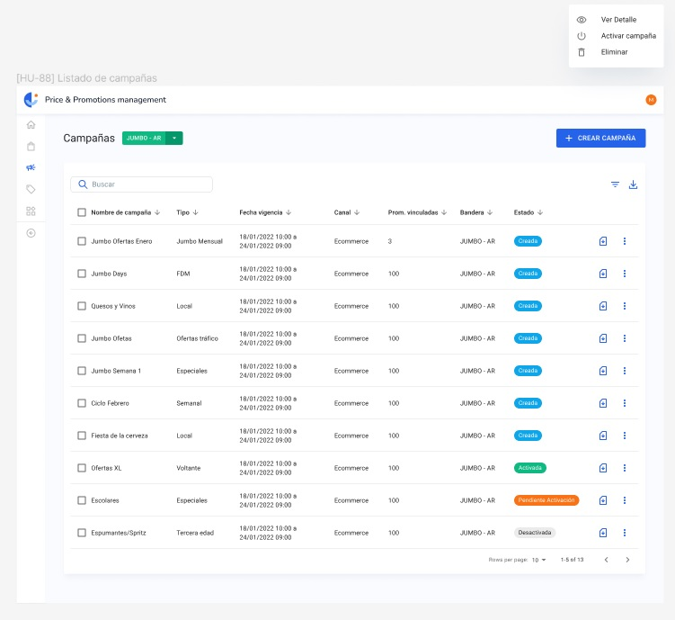
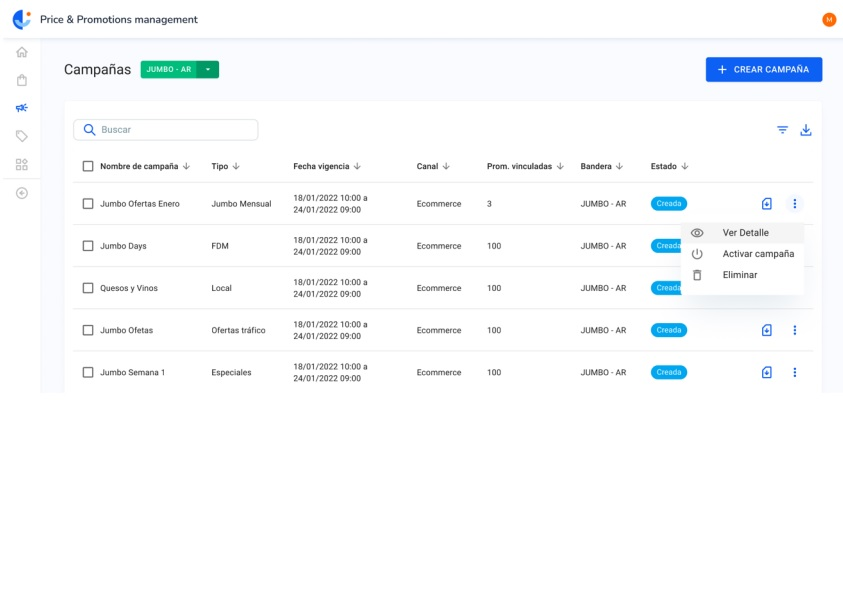
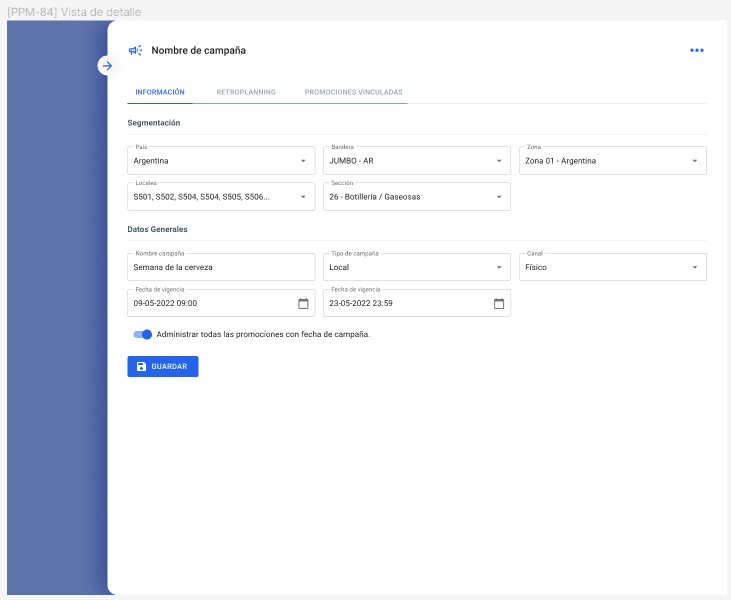

# Prueba Técnica FrontEnd 

### Tecnologías requeridas:

- Reactjs con TypeScript
- MUI
- SCSS (Como plus)

### Objetivos:
- Replicar UI de Figma, manteniendo buen Orden del código y buenas practicas. (Vistas de la tabla y
vista de Detalle).
- Al clickear en el icono de menú Kebab de la tabla, se debe desplegar las opciones (Ver detalle,
Activar Campaña y eliminar) para esta prueba solo se utilizará la opción “Ver detalle”.

